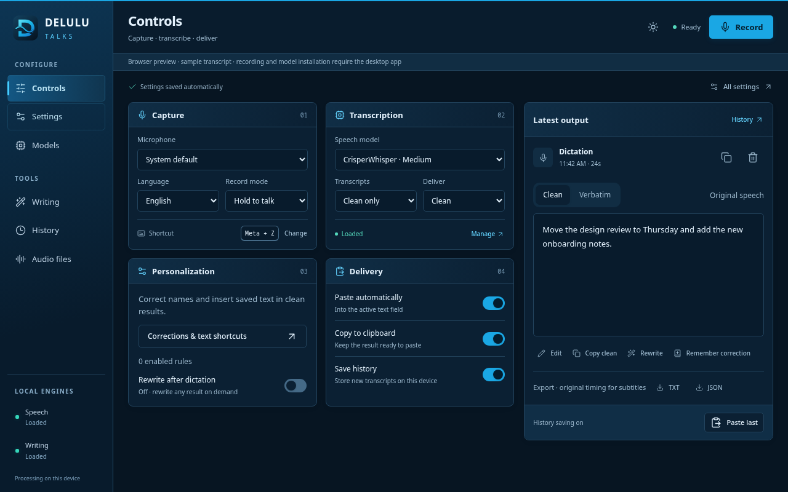

<div align="center">
  
  <p><strong>Native clean dictation. Personal corrections. Optional local rewriting.</strong></p>
  <p>
    <a href="https://github.com/JEMostert/delulu-talks/releases/latest"></a>
    
    
  </p>
  <p>
    <a href="https://github.com/JEMostert/delulu-talks/releases/latest"><strong>Download the latest release</strong></a> ·
    <a href="docs/ARCHITECTURE.md">Architecture</a> ·
    <a href="docs/PRODUCT_RESEARCH.md">Product research</a>
  </p>
</div>

---

Delulu Talks turns speech into text in the app you are using. R2T2 produces dictation locally on your CUDA GPU; Qwen rewriting is an optional tool. Microphone, language, shortcut, and delivery settings are available as soon as you open the app.

## Dictate, review, keep working

```text
Hold your shortcut → Speak → Release
                              │
                  R2T2: local transcription
                              │
                  Corrections + exact text shortcuts
                              │
                      Paste into your app
                              │
                  Review · edit · optionally rewrite
```

Automatic rewriting is off; use **Rewrite** beside a result when you want to shorten or restructure it.

On supported Wayland desktops, the recording pill stays above your apps without taking focus. Hold-to-talk uses the desktop shortcut portal; other desktops use toggle shortcuts. If automatic paste is blocked, the result stays available on the clipboard.

## What it brings

| Feature | What it does |
| --- | --- |
| **System dictation** | Hold-to-talk by default, optional press-to-toggle, tray controls, and desktop-owned shortcut remapping. |
| **Optional rewriting** | Optional local transformations with preview, apply and undo beside each transcript. Automatic rewriting is off by default. |
| **Native Wayland experience** | Uses XDG GlobalShortcuts, secure Remote Desktop paste, and a click-through layer-shell recording pill on supported desktops. |
| **Audio files** | Imports audio or video for local transcription. |
| **Local by design** | Runs speech and writing models on your machine. There is no telemetry or cloud transcription. |

### Corrections and text shortcuts

Open **Settings → Personalization** or the shortcut on Controls. Corrections replace specific recognized text; text shortcuts expand a spoken trigger into an exact saved block. Each rule has a live text preview and conflicting triggers are rejected. Editing a transcript can suggest a correction to remember, with explicit confirmation.

Speech output stays untouched. Personalization creates a separate result, and exact shortcut blocks stay outside the writing model; only the surrounding text is rewritten. Failed automatic rewriting delivers the preserved transcript instead.

Upgrading from an older release turns automatic rewriting and writing-model preloading off once, because earlier defaults did not establish an explicit choice. You can enable either independently afterward. Existing history and rules are retained. Old spelling-only entries are marked as needing a recognized phrase; historical transcripts cannot recover speech text already replaced by an older version.

## Controls on launch

The app opens directly into dictation controls. Microphone, language, shortcut, and delivery switches are immediately accessible. The latest result sits beside them, with editing, correction capture, optional rewriting, and export.

<picture>
  <source media="(prefers-color-scheme: dark)" srcset="docs/assets/controls-dark.png" />
  <source media="(prefers-color-scheme: light)" srcset="docs/assets/controls-light.png" />
  
</picture>

*Current interface captured from the browser preview with demo text. The image follows your light or dark theme.*

The interface uses ocean-blue and navy panels with light/dark/system themes. Settings is at the top of navigation. Writing, file transcription, model management, history and personalization share the same compact visual system. The application icon is a new wave-shaped D.

- **Configure quickly:** priority controls fit above the fold in compact desktop windows.
- **Recover results:** paste the latest transcript, retry failed audio from memory, or discard it explicitly.
- **Preserve originals:** corrections stay separate from model output and optional rewrites.
- **Manage locally:** Settings → Runtime covers memory choices; Settings → Application covers appearance and app updates.

## Local speech and writing models

Speech stays ready by default. The optional writing model loads on demand; you can keep either model loaded or let it unload after a configurable idle period.

| Runtime | Available models | Good for |
| --- | --- | --- |
| **R2T2** (Confucius4-R2T2) | 2B streaming ASR | Low-latency, high-accuracy dictation through vLLM on your CUDA GPU. |
| **Qwen 3.5 writing** | 0.8B · 2B · 4B | Lightweight cleanup through richer prompt and technical-context enhancement. 2B is the balanced default. |

R2T2 runs through the vLLM backend and requires a CUDA GPU.

## Install

Download the package for your platform from [GitHub Releases](https://github.com/JEMostert/delulu-talks/releases/latest).

### Linux

Run the AppImage directly:

```bash
chmod +x Delulu-Talks-*-linux-x86_64.AppImage
./Delulu-Talks-*-linux-x86_64.AppImage
```

Arch and CachyOS users can install the pacman package instead. A portable `tar.xz` is also included. Linux/Wayland is the primary and most thoroughly exercised platform.

### Windows and macOS

Use the Windows installer or the macOS DMG from the same release page. Current packages are not code-signed, so the operating system may ask you to confirm the first launch.

Supported installed packages check GitHub Releases for updates. Downloads are explicit, progress is visible, and restart waits until recording, inference, and setup are idle. Linux automatic updates use AppImage; pacman and portable packages link to manual downloads.

## Your first minute

1. Open Delulu Talks. Controls are immediately available; the inline setup notice points you to model installation.
2. Choose **Install engine**. The app installs the local runtime and downloads the model weights.
3. Focus a text field and use the shortcut shown in Controls. On supported Wayland desktops, hold <kbd>Meta</kbd> + <kbd>Z</kbd>, speak, then release; toggle mode uses a second press to finish.
4. Dictate immediately with native clean output. Optionally open **Writing** to install Qwen, then use **Rewrite** beside any result. Automatic rewriting is a separate opt-in setting.

The app manages separate isolated Python environments for R2T2 speech and Magic rewriting, plus a shared model cache, inside the platform application-data directory. Existing shared runtimes are detected as an “Update setup” migration instead of failing with a package conflict. Setup uses versioned dependency specifications, checks package compatibility, and records installed versions. Models → device health check reports Python, FFmpeg, memory, and runtime details; Settings → Application offers repair and update controls.

## Run from source

You will need [Bun](https://bun.sh/), Python 3.11–3.13 (3.11 or 3.12 recommended), and FFmpeg for compressed audio or video imports.

```bash
bun install
bun run dev
```

For a renderer-only preview with safe demo data:

```bash
bun run dev:web
```

On Arch-based Wayland systems, install the native overlay dependencies with:

```bash
sudo pacman -S ffmpeg gtk4-layer-shell python-gobject python-cairo
```

## How it fits together

```text
Electron main process
├── lifecycle, tray, updater, global shortcuts, validated IPC
├── native Wayland overlay + secure paste services
├── persistent Python worker
│   ├── R2T2 speech runtime
│   └── Qwen writing runtime
└── sandboxed React renderer
    ├── Controls + Writing
    ├── Audio files + History + Personalization
    └── Models + Settings + onboarding
```

<details>
<summary><strong>Build and package</strong></summary>

```bash
bun run typecheck
bun test
bun run test:e2e
bun run test:desktop
bun run build
python3 -m py_compile electron/python/transcription_engine.py
bun run dist:linux
```

Linux packaging produces AppImage, pacman, and `tar.xz` artifacts. The release workflow verifies browser and isolated desktop workflows, then builds native Linux, macOS, and Windows packages on version tags. A tag must match the package version before it can publish.

</details>

<details>
<summary><strong>Repository map</strong></summary>

```text
electron/
  main.ts             lifecycle, windows, tray, shortcuts, validated IPC
  preload.ts          isolated renderer API
  services/           ASR, dictation, overlay, shortcuts, storage, paste, export
  overlay/            GTK4 layer-shell recording pill helper
  python/             persistent speech + Magic worker
src/
  components/         Electron app shell components
  pages/              Controls, Writing, Audio files, History, Models, Settings
  bridge.ts           typed Electron/browser boundary
  recorder.ts         microphone capture and 16 kHz WAV encoder
  data.ts             R2T2, Qwen, and language catalogs
```

</details>

## Privacy and licenses

Microphone recordings are written to a temporary WAV only after capture, processed locally, and deleted after success or failure. Failed captures can remain in memory for Retry during the session; Discard releases them, and closing the app loses that recovery copy. Imported media is never modified; temporary FFmpeg conversions are deleted too. Settings, optional transcript history, corrections, the Python environment, and downloaded models stay under Electron's application-data directory.

Delulu Talks is [MIT licensed](LICENSE). R2T2 inference code is Apache-2.0; the [model weights](https://huggingface.co/netease-youdao/Confucius4-R2T2) use the [NetEase Model Use License](https://github.com/netease-youdao/Confucius4-R2T2/blob/master/MODEL_LICENSE) and require a CUDA GPU. Delulu Talks does not bundle weights. Optional [Qwen 3.5 checkpoints](https://huggingface.co/Qwen/Qwen3.5-2B) are Apache-2.0 licensed.

## Development checks

Development uses its own **Delulu Talks Dev** profile, audio cache, and Linux desktop entry. It does not import production history, overwrite the installed launcher, automatically bind the production shortcut, or change login startup. `DELULU_USER_DATA_DIR` is an explicit development/test override; do not point it at your everyday profile.

Repairs build a fresh environment under `speech-venv/generations/` (or the Writing runtime root), validate dependencies and imports, then atomically activate it. Virtualenv directories are never renamed. Failed installation leaves the previous runtime selected; a failed initial model load rolls activation back. Previous and interrupted generations are retained for recovery, so repairs temporarily require extra disk space. The existing `asr-venv` can still be the active Writing runtime; do not delete it merely because its name is old.

Cold starts load model weights into GPU memory. **Settings → Runtime → Keep speech ready** keeps speech resident between recordings; turn it off when you prefer to reclaim VRAM after the idle delay. Unload stops the worker process tree, including vLLM's GPU subprocesses.

```bash
bun run format:check
bun run typecheck
bun test
bunx playwright install chromium
bun run test:e2e
bun run test:desktop
```

The desktop smoke check uses temporary user data and skips global desktop integration. For opt-in real model verification with an existing runtime and cached models:

```bash
/path/to/asr-venv/bin/python scripts/runtime-smoke.py --cache /path/to/models --magic
```

To exercise the full Electron transcription, correction and export path with the same existing runtime:

```bash
bun run build
node scripts/desktop-smoke.mjs "/path/to/Delulu Talks user data"
```

Add `--lifecycle --writing` to test three real speech unload/reload/transcribe cycles, Writing, and a return to speech. Close the everyday app first so the test has enough GPU memory. The test uses temporary settings/history and the existing cached models; it does not install or repair the linked runtimes.

This uses temporary settings/history, disables clipboard/paste, and runs offline against cached models. The Python command above also runs offline against the included short audio sample. It is a smoke check, not a general accuracy benchmark. See [architecture](docs/ARCHITECTURE.md), [design system](docs/GUI_DESIGN.md), and the [rebuild plan and validation record](docs/REBUILD_PLAN.md).
