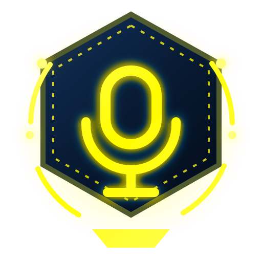

<div align="center">
  

  # Delulu Talks

  **Hold. Speak. Release. Your words land polished wherever you are typing.**

  [](https://github.com/JEMostert/delulu-talks/releases/latest)
  
  

  [**Download the latest release**](https://github.com/JEMostert/delulu-talks/releases/latest) · [Architecture](docs/ARCHITECTURE.md) · [Product research](docs/PRODUCT_RESEARCH.md)
</div>

---

Delulu Talks is private desktop dictation built around one system-wide shortcut. It keeps a fast speech model ready, understands both what you meant and exactly what you said, and can pass the result through a local Qwen model before delivering it to the app you were already using.

## One shortcut. The complete pipeline.

```text
Hold Ctrl + Shift + Space
          │
          ▼
     speak naturally
          │
          ▼
  CrisperWhisper 2.0 ──► intended + verbatim transcripts
          │
          ├── Magic disabled ──────────────────────────┐
          │                                            │
          └── Magic enabled ──► local Qwen rewrite ───┤
                                                       ▼
                                              clipboard + paste
```

Release the shortcut and Delulu Talks finishes the job. The native recording pill stays above your apps without stealing pointer or keyboard input, and automatic paste falls back honestly to the clipboard when the desktop blocks synthetic input.

## What it brings

| Feature | What it does |
| --- | --- |
| **System dictation** | Hold-to-talk by default, optional press-to-toggle, tray controls, and desktop-owned shortcut remapping. |
| **Two transcripts** | Produces a clean intended transcript alongside an exact verbatim view you can edit, restore, copy, or export. |
| **Magic rewrites** | Turns rough speech or existing drafts into concise messages, polished notes, structured documents, and detailed prompts. |
| **Native Wayland experience** | Uses XDG GlobalShortcuts, secure Remote Desktop paste, and a click-through layer-shell recording pill on supported desktops. |
| **Speech Lab** | Imports audio or video for transcription, Verbatimize, forced alignment, word timelines, and SRT/VTT export. |
| **Local by design** | Runs speech and writing models on your machine. There is no telemetry or cloud transcription. |

## Pick the right-sized brain

Speech and Magic can stay loaded together. Pin the models you use every day, or let Delulu Talks unload them after a configurable idle period.

| Runtime | Available models | Good for |
| --- | --- | --- |
| **CrisperWhisper 2.0** | Small · Medium · Turbo · Large | Fast dictation through maximum transcription quality. Medium is the balanced default. |
| **Qwen 3.5 Magic** | 0.8B · 2B · 4B | Lightweight cleanup through richer prompt and technical-context enhancement. 2B is the balanced default. |

On Linux x64, Auto uses the accelerated CTranslate2 backend and supports Large + Turbo speculative decoding. Other platforms use the portable Transformers runtime.

## Install

Download the package for your platform from [GitHub Releases](https://github.com/JEMostert/delulu-talks/releases/latest).

### Linux

Run the AppImage directly:

```bash
chmod +x Delulu-Talks-*-linux-x86_64.AppImage
./Delulu-Talks-*-linux-x86_64.AppImage
```

Arch and CachyOS users can install the pacman package instead. A portable `tar.xz` is also included. Linux/Wayland is the primary and most thoroughly exercised platform.

### Windows and macOS

Use the Windows installer or the macOS DMG from the same release page. Current packages are not code-signed, so the operating system may ask you to confirm the first launch.

Delulu Talks checks GitHub Releases for updates, displays download progress, and offers a safe restart when the next version is ready.

## Your first minute

1. Start Delulu Talks and work through the short setup intro.
2. Choose **Install engine**. A focused modal explains the Nyra model license and records acceptance before downloading anything.
3. Focus any text field, hold <kbd>Ctrl</kbd> + <kbd>Shift</kbd> + <kbd>Space</kbd>, speak, then release.
4. Optionally open **Magic**, install a Qwen model, and choose the rewrite style that should run in your shortcut pipeline.

The app manages its own isolated Python environment and model cache inside the platform application-data directory.

## Run from source

You will need [Bun](https://bun.sh/), Python 3.10–3.13 (3.11 or 3.12 recommended), and FFmpeg for compressed audio or video imports.

```bash
bun install
bun run dev
```

For a renderer-only preview with safe demo data:

```bash
bun run dev:web
```

On Arch-based Wayland systems, install the native overlay dependencies with:

```bash
sudo pacman -S ffmpeg gtk4-layer-shell python-gobject python-cairo
```

## How it fits together

```text
Electron main process
├── lifecycle, tray, updater, global shortcuts, validated IPC
├── native Wayland overlay + secure paste services
├── persistent Python worker
│   ├── CrisperWhisper speech runtime
│   └── Qwen Magic runtime
└── sandboxed React renderer
    ├── Dictation + Magic
    ├── Speech Lab + History + Wordbook
    └── Models + Settings + onboarding
```

<details>
<summary><strong>Build and package</strong></summary>

```bash
bun run typecheck
bun test
bun run build
python3 -m py_compile electron/python/transcription_engine.py
bun run dist:linux
```

Linux packaging produces AppImage, pacman, and `tar.xz` artifacts. The release workflow builds native Linux, macOS, and Windows packages on version tags.

</details>

<details>
<summary><strong>Repository map</strong></summary>

```text
electron/
  main.ts             lifecycle, windows, tray, shortcuts, validated IPC
  preload.ts          isolated renderer API
  services/           ASR, dictation, overlay, shortcuts, storage, paste, export
  overlay/            GTK4 layer-shell recording pill helper
  python/             persistent speech + Magic worker
src/
  components/         Electron app shell components
  pages/              Dictation, Magic, Speech Lab, History, Models, Settings
  bridge.ts           typed Electron/browser boundary
  recorder.ts         microphone capture and 16 kHz WAV encoder
  data.ts             CrisperWhisper, Qwen, and language catalogs
```

</details>

## Privacy and licenses

Microphone recordings are written to a temporary WAV only after capture, processed locally, and deleted after success or failure. Imported media is never modified; temporary FFmpeg conversions are deleted too. Settings, optional transcript history, corrections, the Python environment, and downloaded models stay under Electron's application-data directory.

Delulu Talks is [MIT licensed](LICENSE). CrisperWhisper inference code is MIT, while its standard 2.0 weights use the Nyra Health Non-Commercial Research License; commercial use requires a separate Nyra license. Delulu Talks does not bundle weights or offer Pro downloads. Read [Nyra's license explanation](https://github.com/nyrahealth/CrisperWhisper#license) and the [weight license](https://huggingface.co/nyralabs/CrisperWhisper2.0_large/blob/main/LICENSE.md). Optional [Qwen 3.5 checkpoints](https://huggingface.co/Qwen/Qwen3.5-2B) are Apache-2.0 licensed.

<div align="center">
  <strong>Your voice stays yours.</strong>
</div>
