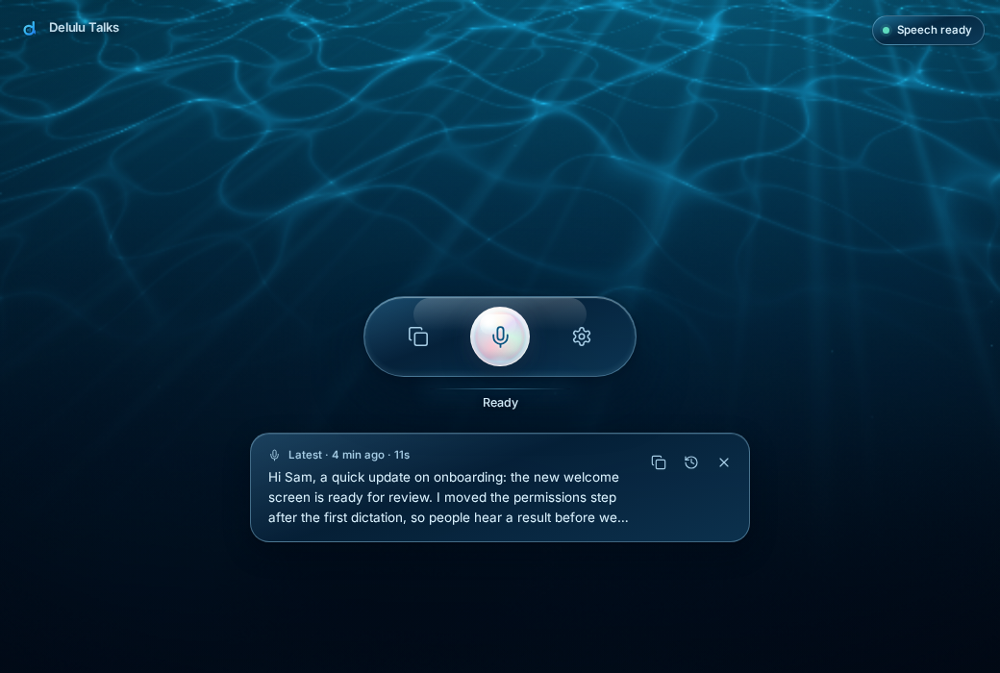

<div align="center">
  
  <p><strong>Native clean dictation. Personal corrections. Optional local rewriting.</strong></p>
  <p>
    <a href="https://github.com/JEMostert/delulu-talks/releases/latest"></a>
    
    
  </p>
  <p>
    <a href="https://github.com/JEMostert/delulu-talks/releases/latest"><strong>Download the latest release</strong></a> ·
    <a href="docs/ARCHITECTURE.md">Architecture</a> ·
    <a href="https://github.com/JEMostert/delulu-talks/issues/14">GitHub roadmap</a> ·
    <a href="docs/MODEL_RESEARCH.md">Model research</a> ·
    <a href="docs/MAC_SUPPORT.md">Mac support</a> ·
    <a href="docs/WINDOWS_SUPPORT.md">Windows support</a>
  </p>
</div>

---

Delulu Talks turns speech into text in the app you are using. R2T2 produces dictation locally through MLX on Apple Silicon and Transformers on NVIDIA GPUs; the lighter Nemotron 3.5 Streaming types word by word as you speak and can run on the CPU. Qwen rewriting is an optional tool. Microphone, language, shortcut, and delivery settings are available as soon as you open the app.

## Dictate, review, keep working

```text
Hold your shortcut → Speak → Release
                              │
                  R2T2: local transcription
                              │
                  Corrections + exact text shortcuts
                              │
                      Paste into your app
                              │
                  Review · edit · optionally rewrite
```

With **live typing** (on by default), your words appear at the cursor while you are still speaking: Nemotron types word by word, R2T2 types each phrase when you pause. Live typing waits for the finished text when automatic rewriting or spoken punctuation commands are on.

Automatic rewriting is off; use **Rewrite** beside a result when you want to shorten or restructure it.

On supported Wayland desktops, a small pearl pill with wave bars stays above your apps without taking focus. Hold-to-talk uses the desktop shortcut portal; other desktops use toggle shortcuts. If automatic paste is blocked, the result stays available on the clipboard.

## What it brings

| Feature                       | What it does                                                                                                                 |
| ----------------------------- | ---------------------------------------------------------------------------------------------------------------------------- |
| **System dictation**          | Hold-to-talk by default, optional press-to-toggle, live typing, tray controls and desktop-owned shortcut remapping.          |
| **Optional rewriting**        | Optional local transformations with preview, apply and undo beside each transcript. Automatic rewriting is off by default.   |
| **Native Wayland experience** | Uses XDG GlobalShortcuts, secure Remote Desktop paste, and a click-through layer-shell recording pill on supported desktops. |
| **Audio files**               | Imports audio or video for local transcription.                                                                              |
| **Local by design**           | Runs speech and writing models on your machine. There is no telemetry or cloud transcription.                                |

### Corrections and text shortcuts

Open **Personalization** from the dock or the command palette. Corrections replace specific recognized text; text shortcuts expand a spoken trigger into an exact saved block. Each rule has a live text preview and conflicting triggers are rejected. Editing a transcript can suggest a correction to remember, with explicit confirmation.

Speech output stays untouched. Personalization creates a separate result, and exact shortcut blocks stay outside the writing model; only the surrounding text is rewritten. Failed automatic rewriting delivers the preserved transcript instead.

Upgrading from an older release turns automatic rewriting and writing-model preloading off once, because earlier defaults did not establish an explicit choice. You can enable either independently afterward. Existing history and rules are retained. Old spelling-only entries are marked as needing a recognized phrase; historical transcripts cannot recover speech text already replaced by an older version.

## The interface

Delulu Talks opens onto a living ocean with one pearl record button. Press it — or your shortcut from any app — and the pearl turns coral with a voice-level halo and a running clock; when you stop, your words are pasted where you were typing and the latest transcript floats beneath the controls with copy and open-in-history actions.

<picture>
  <source media="(prefers-color-scheme: dark)" srcset="docs/assets/controls-dark.png" />
  <source media="(prefers-color-scheme: light)" srcset="docs/assets/controls-light.png" />
  
</picture>

_Captured from the browser preview with demo text. The image follows your light or dark theme._

The **Deep Sea** design system has two themes — _Abyss_ (dark) and _Shallows_ (sunlit, light) — and follows your system by default. A glass sheet rises above a compact dock for History, Audio files, Models, Personalization, the Editor and Settings; <kbd>Ctrl</kbd>/<kbd>⌘</kbd> + <kbd>Shift</kbd> + <kbd>P</kbd> opens the command palette. The tray icon shows whether you are recording, busy, need attention or have an update; its menu switches the speech engine, live typing and rewriting style, and copies any of your five most recent transcripts. See the [design system](docs/DESIGN-SYSTEM.md) and [brand assets](docs/BRAND.md).

- **Configure quickly:** the gear opens quick settings for microphone, language, shortcut, paste and theme.
- **Recover results:** paste the latest transcript, retry failed audio from memory, or discard it explicitly.
- **Preserve originals:** corrections stay separate from model output and optional rewrites.
- **Keep history small:** History keeps your latest 50 transcripts by default (25–500 in Settings → Privacy), shown as a list beside the selected transcript.
- **Manage locally:** Settings is organized as General, Speech, Output, Rewriting, Profiles, Privacy and Advanced; Advanced covers runtimes and updates.

## Local speech and writing models

Speech stays ready by default. The optional writing model loads on demand; you can keep either model loaded or let it unload after a configurable idle period.

| Runtime                            | Available models                   | Good for                                                                                                 |
| ---------------------------------- | ---------------------------------- | -------------------------------------------------------------------------------------------------------- |
| **R2T2 MLX** (Apple Silicon)       | BF16 conversion of Confucius4-R2T2 | Direct local MLX speech inference with language hints; native validation pending.                        |
| **R2T2 CUDA** (Linux / Windows)    | Confucius4-R2T2                    | Most accurate, especially in Dutch. About 4 GB of GPU memory through Transformers. The default.          |
| **Nemotron 3.5** (Linux / Windows) | nemotron-3.5-asr-streaming-0.6b    | True word-by-word streaming. About 1.3 GB of GPU memory, or CPU only; less accurate in Dutch.            |
| **Qwen 3.5 writing**               | 0.8B · 2B · 4B                     | Lightweight cleanup through richer prompt and technical-context enhancement. 2B is the balanced default. |

On Apple Silicon with macOS 15+, Delulu selects the approximately 4.1 GB [R2T2 BF16 MLX conversion](https://huggingface.co/mlx-community/Confucius4-R2T2-bf16). This preserves the preferred fine-tune instead of substituting Qwen3-ASR-0.6B. The checkpoint revision and runtime packages are pinned. Language hints are available; missing or mixed detected language stays unknown. Older Mac installations need **Update setup/Repair** for the new runtime.

**The new R2T2 Mac route is implemented but has not passed native Apple Silicon inference validation in this development pass.** See [Mac support, evidence boundaries and acceptance steps](docs/MAC_SUPPORT.md#native-release-acceptance). The [historical v0.9.4 validation](docs/mac-release-validation.md) applies to Qwen3-ASR-0.6B through vLLM Metal, not the current direct R2T2 MLX Audio route. Live typing is available with CUDA and CPU speech; on Mac, capture completes before transcription and paste. See [the capture boundary](docs/audio-stream-protocol.md).

Linux and Windows share one PyTorch/Transformers speech runtime; v0.12.0 removed the earlier Linux vLLM server, which reserved most of the GPU's memory. Existing Linux installations need **Update setup** once. **Native Windows inference still requires hardware validation.** See [Windows support](docs/WINDOWS_SUPPORT.md). Intel Macs and Rosetta Python are unsupported. R2T2 is the default; Nemotron 3.5 is the light alternative on Linux and Windows. [Model research](docs/MODEL_RESEARCH.md) keeps other models as external benchmark references. Optional Qwen 3.5 rewriting remains available.

## Install

Download the package for your platform from [GitHub Releases](https://github.com/JEMostert/delulu-talks/releases/latest).

### Linux

Run the AppImage directly:

```bash
chmod +x Delulu-Talks-*-linux-x86_64.AppImage
./Delulu-Talks-*-linux-x86_64.AppImage
```

Arch and CachyOS users can install the pacman package instead. A portable `tar.xz` is also included. Linux/Wayland is the primary and most thoroughly exercised platform.

### Windows and macOS

Use the Windows installer or the macOS DMG from the same release page. Mac packages target Apple Silicon and are not Developer ID signed or notarized. If macOS blocks launch, use System Settings → Privacy & Security → Open Anyway for the app you downloaded from this repository. Automatic installation of Mac updates is disabled for these unsigned builds: download the new DMG, quit Delulu, replace the app in Applications, and reopen it. Settings, history, and models stay in the application-data directory.

Supported installed packages check GitHub Releases for updates. Downloads are explicit, progress is visible, and restart waits until recording, inference, and setup are idle. Linux automatic updates use AppImage; pacman and portable packages link to manual downloads.

## Your first minute

1. Open Delulu Talks. The pearl record button is ready immediately; the “Set up speech” chip and the Models page guide model installation.
2. Choose **Install engine**. The app installs the local runtime and downloads the model weights.
3. Focus a text field and use the shortcut shown in quick settings. On supported Wayland desktops, hold <kbd>Meta</kbd> + <kbd>Z</kbd>, speak, then release; toggle mode uses a second press to finish.
4. Dictate immediately with native clean output. Optionally install the rewriting engine in **Models**, then use **Rewrite** beside any result to preview, apply, or undo it. Automatic rewriting is a separate opt-in setting.

The app manages separate isolated Python environments for platform-selected speech and rewriting, plus a shared model cache, inside the platform application-data directory. Existing shared runtimes are detected as an “Update setup” migration instead of failing with a package conflict. Setup uses versioned dependency specifications, checks package compatibility, and records installed versions. Models → device health check reports Python, FFmpeg, memory, and runtime details; Settings → Advanced offers repair controls and updates.

## Run from source

You will need [Bun](https://bun.sh/), **Python 3.12 on Windows and native arm64 Python 3.12 on Apple Silicon** (Python 3.11–3.13 for Linux CUDA), and FFmpeg for compressed audio or video imports. On Mac, install Python using `brew install python@3.12` or `uv python install 3.12`; set its full path under Settings → Advanced if necessary. The Mac speech environment installs pinned MLX, MLX Audio, and Transformers packages.

```bash
bun install
bun run dev
```

For a renderer-only preview with safe demo data:

```bash
bun run dev:web
```

On Arch-based Wayland systems, install the native overlay dependencies with:

```bash
sudo pacman -S ffmpeg gtk4-layer-shell python-gobject python-cairo
```

## How it fits together

```text
Electron main process
├── lifecycle, tray, updater, global shortcuts, validated IPC
├── native Wayland overlay + secure paste services
├── persistent Python worker
│   ├── R2T2 speech runtime
│   └── Qwen writing runtime
└── sandboxed React renderer
    ├── ocean shell, dock + contextual transcript rewriting
    ├── Audio files + History + Personalization
    └── Models + Settings + onboarding
```

<details>
<summary><strong>Build and package</strong></summary>

```bash
bun run typecheck
bun run test
bun run test:e2e
bun run build
python3 -m py_compile electron/python/transcription_engine.py
bun run dist:linux
```

Linux packaging produces AppImage, pacman, and `tar.xz` artifacts. The release workflow runs the focused unit and existing browser tests, then builds native Linux, macOS, and Windows packages on version tags. A tag must match the package version before it can publish.

</details>

<details>
<summary><strong>Repository map</strong></summary>

```text
electron/
  main.ts             lifecycle, windows, tray, shortcuts, validated IPC
  preload.ts          isolated renderer API
  services/           ASR, dictation, overlay, shortcuts, storage, paste, export
  overlay/            GTK4 layer-shell recording pill helper
  python/             persistent speech + rewriting worker
src/
  components/         Electron app shell components
  pages/              Audio files, History, Models, Personalization, Editor, Settings
  styles/             Deep Sea tokens, primitives, shell and feature styles
  bridge.ts           typed Electron/browser boundary
  recorder.ts         microphone capture and 16 kHz WAV encoder
  data.ts             R2T2, Qwen, and language catalogs
```

</details>

File transcription reads media metadata after you explicitly select a source file. Before starting, it shows duration, channels, sample rate, decoder availability and an estimated mono 16 kHz PCM size. Elapsed processing time remains explicitly unknown because hardware, model residency and media length affect it. Inspection uses bounded header-only soundfile/FFprobe probes and an FFmpeg availability check; it does not load a speech model, download dependencies, convert media or modify the source. Full decoding still occurs only when transcription starts. Missing metadata is shown as unknown.

## Privacy and licenses

Microphone recordings are written to a temporary WAV only after capture, processed locally, and deleted after success or failure. Failed captures can remain in memory for Retry during the session; Discard releases them, and closing the app loses that recovery copy. Imported media is never modified; temporary FFmpeg conversions are deleted too. Settings, optional transcript history, corrections, the Python environment, and downloaded models stay under Electron's application-data directory.

With **Keep local history** off, new dictation and imported-file results are session-only, including their original text, personalization, corrections, and rewrites. Main and renderer retain at most the newest 20 session records and 8 MiB of UTF-8 strings per transcript collection; the newest record is kept whole even if it alone exceeds that budget. Older records are evicted whole, never truncated. These are text retention limits, not a total process RAM cap: active inference, failed-recording retry audio and bounded worker diagnostics use separate memory. Session results disappear on exit, are never automatically promoted to saved history when the setting is re-enabled, and remain explicitly exportable while retained. Existing saved history remains on disk and edits to those saved records still persist. Disabling history also suppresses automatic speech/writing error-log writes, which can include model diagnostics; existing logs are not deleted. Explicit clipboard/paste delivery and exports can create copies outside the app.

Temporary microphone WAVs and converted import audio still use the app audio-cache directory while processing, regardless of the history setting; normal success and failure paths delete them. An abrupt process exit can leave temporary audio behind. The app does not automatically write transcript-text sidecars for these files.

Delulu Talks is [MIT licensed](LICENSE). Vendored conversion helpers and their license are recorded in [third-party notices](docs/THIRD_PARTY_NOTICES.md). R2T2 inference code is Apache-2.0; the [model weights](https://huggingface.co/netease-youdao/Confucius4-R2T2) use the [NetEase Model Use License](https://github.com/netease-youdao/Confucius4-R2T2/blob/master/MODEL_LICENSE); R2T2 on Linux and Windows requires an NVIDIA CUDA GPU; [Nemotron 3.5 Streaming](https://huggingface.co/nvidia/nemotron-3.5-asr-streaming-0.6b) weights use the [OpenMDW 1.1 license](https://openmdw.ai/license/1-1/) and also run on the CPU, while the MLX conversion targets Apple Silicon. Delulu Talks does not bundle weights. Optional [Qwen 3.5 checkpoints](https://huggingface.co/Qwen/Qwen3.5-2B) are Apache-2.0 licensed.

## Development checks

The focused unit suite covers data preservation, dictation recovery, paste safety,
worker messages, exact text blocks, and runtime rollback.
`bun run test` runs both TypeScript and dependency-free Python units; the existing
browser tests run separately and check microphone capture and cleanup with synthetic audio.
See [testing](docs/VERIFICATION.md) for commands and scope.

Development uses its own **Delulu Talks Dev** profile, audio cache, and Linux desktop entry. It does not import production history, overwrite the installed launcher, automatically bind the production shortcut, or change login startup. `DELULU_USER_DATA_DIR` is an explicit development/test override; do not point it at your everyday profile.

Repairs build a fresh environment under `speech-venv/generations/` (or the Writing runtime root), validate dependencies and imports, then atomically activate it. Virtualenv directories are never renamed. Failed installation leaves the previous runtime selected; a failed initial model load rolls activation back. Previous and interrupted generations are retained for recovery, so repairs temporarily require extra disk space. The existing `asr-venv` can still be the active Writing runtime; do not delete it merely because its name is old.

Cold starts load model weights into GPU memory. **Settings → Speech → Keep the model ready** keeps speech resident between recordings; turn it off when you prefer to reclaim VRAM after the idle delay. Unload stops the worker process tree. Nemotron falls back to the CPU automatically when another app has filled the GPU.

```bash
bun run format:check
bun run typecheck
bun run test
bunx playwright install chromium
bun run test:e2e
```

For optional real-model validation with an existing runtime and cached models,
use the [native inference harness](docs/NATIVE_HARNESS.md). These hardware checks
are separate from the fast test suite.

For cold-start and first-response latency, close the everyday app and run:

```bash
bun scripts/benchmark-speech.mjs "/path/to/Delulu Talks user data"
```

This reports startup including synthetic inference warm-up, then first, changed-input, and repeated-input transcription timings. It uses cached models, temporary audio, and no user history or clipboard. In a local RTX 4090 test with the included 4.59-second sample, 0.9.3 reduced the first post-ready worker round trip from 1.82 seconds to 54 ms; the changed-input check took 85 ms. Startup remained about 25 seconds. These are single-machine sample measurements, not general latency guarantees; repeated inputs may benefit from caching.

Ready now follows a bounded synthetic transcription warm-up. Recording timings include worker communication and any on-demand model load, rather than just GPU inference; they do not include microphone capture, optional Writing, or paste delivery. Short dictations time out after two minutes, longer captures scale up to fifteen minutes, and imported files allow fifteen minutes. Model installation/loading retains a separate download-sized deadline. Busy shortcut notices dismiss on release, cancellation, readiness, or after two seconds, without queuing an unexpected recording.

The benchmark uses the active speech runtime and cached models, with no clipboard/paste delivery. It measures a supplied audio sample; it is not a general accuracy benchmark. See [architecture](docs/ARCHITECTURE.md), [design system](docs/GUI_DESIGN.md), and the [rebuild plan and validation record](docs/REBUILD_PLAN.md).

The [historical roadmap](https://github.com/JEMostert/delulu-talks/issues/14) now serves as a record of the broader plan. The current scope is the desktop dictation app: R2T2 speech, explicit profiles and vocabulary, a technical text buffer, optional local Qwen 3.5 rewrite previews, and local history and audio imports. CLI/API servers, editor extensions, watched folders, cloud/account features and meeting-summary pipelines are outside this scope. The unfinished live streaming experiment has been removed; all platforms use buffered capture. Automated fixtures do not establish native MLX/CUDA inference, physical microphone behavior or delivery into another application. Native platform acceptance remains pending.
