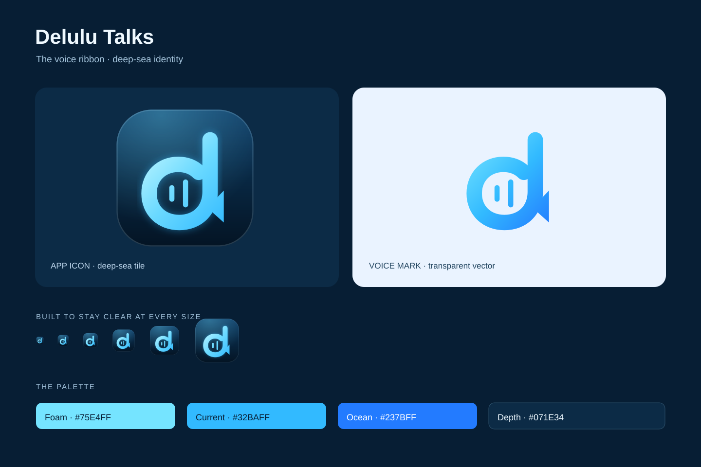

# Delulu Talks identity

The voice ribbon is a single luminous stroke that forms a lowercase **d**, ends
in a speech tail, and holds two voice pulses in its bowl. It glows the way light
does under water: foam at the top, current in the middle, ocean at the base. The
deep-sea tile is the application icon; the mark also works on its own with
transparency. The interface around it follows the [Deep Sea design
system](DESIGN-SYSTEM.md).



## Assets

| Asset                                           | Purpose                                                     |
| ----------------------------------------------- | ----------------------------------------------------------- |
| `public/delulu-talks-icon.svg`                  | Editable app icon master, also used in the renderer/favicon |
| `public/delulu-talks-mark.svg`                  | Transparent editable voice-ribbon master                    |
| `build/icon.png`, `.ico`, `.icns`               | Native Linux, Windows, and Mac app icons                    |
| `build/tray/tray-<state>.png` (+ `@2x`)         | Linux color tray icons at 22 and 44 px                      |
| `build/tray/tray-<state>.ico`                   | Windows tray icons, 16–64 px                                |
| `build/tray/tray-<state>Template.png` (+ `@2x`) | Monochrome macOS menu-bar templates                         |
| `docs/assets/readme-header.svg`                 | Editable repository banner                                  |
| `docs/assets/brand-preview.svg`                 | Portable presentation with embedded vector copies           |

Tray states are `idle`, `recording` (coral dot), `busy` (white dot or ring),
`attention` (amber dot or triangle), and `update` (sea-glass dot or diamond).
Color tray icons carry a depth-navy outline so the ribbon reads on light and
dark panels; the tray glyph drops the inner pulses, which blur below 24 px.

## Palette

| Name    | Hex       | Use                                              |
| ------- | --------- | ------------------------------------------------ |
| Foam    | `#75E4FF` | Highlights, the top of the ribbon gradient       |
| Current | `#32BAFF` | Dark-theme accent, focus, selection              |
| Ocean   | `#237BFF` | Base of the ribbon gradient, light-theme accents |
| Depth   | `#071E34` | Tiles, dark surfaces, outlines                   |
| Coral   | `#FF6F86` | Recording only                                   |

The ribbon gradient is for the mark. Interface controls use the semantic theme
tokens, whose text contrast is verified by `bun scripts/check-contrast.mjs`. Do
not use foam or current for small text on white.

Keep the mark's aspect ratio. Leave clear space around it of at least one ribbon
width; the icon tile supplies its own padding. Use the color master at 24 px or
larger; below that, use the tray glyph.

## Rebuild native assets

Install `rsvg-convert` and Pillow, then run:

```sh
python3 scripts/build-brand-assets.py
```

The script renders icons, tray states and previews from the editable vector
masters. It generates multiple ICO/ICNS resolutions, every tray state per
platform, and refreshes the vector snapshots embedded in the presentation. No
image-generation service or tracing step is involved.
